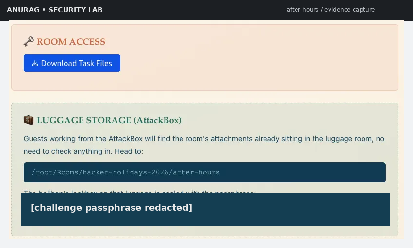
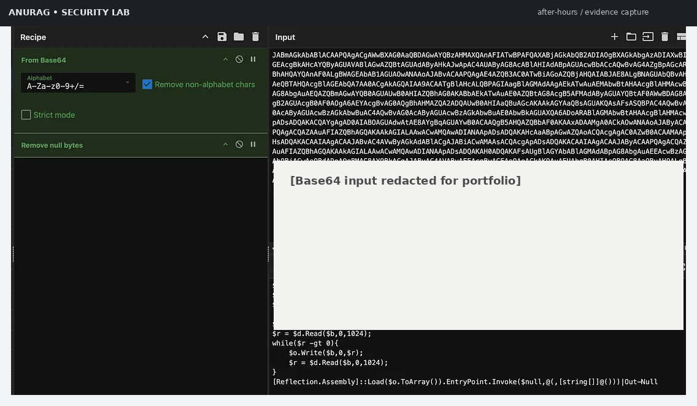
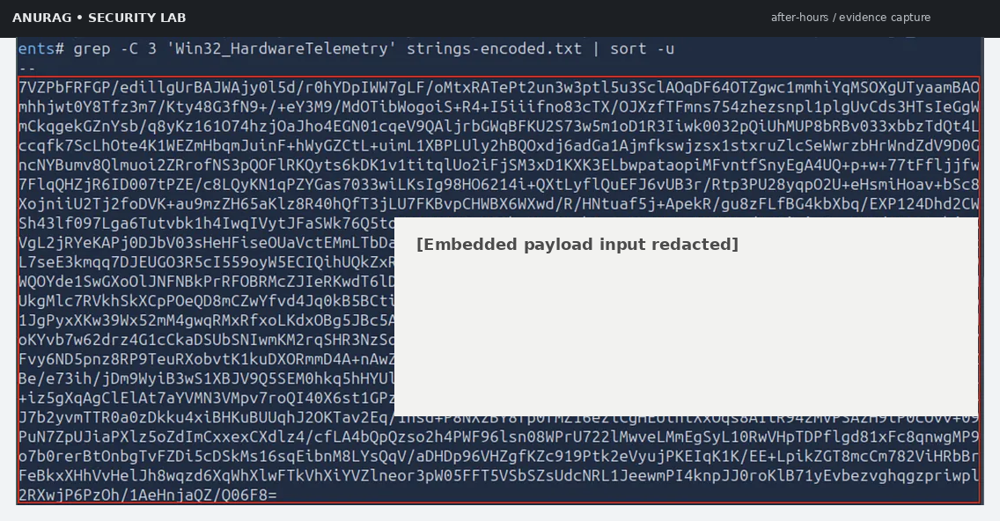

# Hacker Holidays 2026 — Day 12: After Hours
## TryHackMe Forensics Investigation Report

> **Room:** After Hours  
> **Series:** Hacker Holidays 2026 — Day 12  
> **Category:** Forensics  
> **Difficulty:** Medium  
> **Lab:** TryHackMe / authorized training environment

---

## 1. Executive Summary

**After Hours** is a forensic investigation challenge centered on a suspicious Windows persistence mechanism hidden inside system artifacts.

The investigation starts with a supplied archive containing filesystem artifacts and analysis tooling. Rather than relying on obvious persistence locations, the challenge places the relevant configuration in less-conventional system data. The investigation therefore follows an evidence-driven workflow:

1. Extract and inventory the supplied artifacts.
2. Generate strings from the artifact set.
3. Search for PowerShell execution indicators.
4. Recover and decode an encoded PowerShell loader.
5. Identify the WMI-backed custom configuration referenced by the loader.
6. Extract and decompress the embedded payload.
7. Confirm the output is a Windows Portable Executable.
8. Decompile the .NET executable with ILSpy.
9. Trace the encoded value embedded in the malicious class.
10. Base64-decode the final value.

For portfolio publication, direct-answer material is intentionally redacted.

---

## 2. Investigation Objectives

The challenge can be reduced to three forensic objectives:

| Objective | Evidence sought | Result |
|---|---|---|
| Locate hidden configuration | Suspicious strings and system-provider references | WMI-backed custom configuration identified |
| Recover malicious payload | Encoded configuration / embedded PE | .NET payload recovered |
| Recover challenge answer | Encoded value inside analyzed program | Decoding path confirmed; final value redacted |

---

## 3. Environment & Tooling

The supplied challenge environment already provides the material required for the investigation.

### Primary tooling

- **TryHackMe AttackBox** — isolated lab execution environment
- **7-Zip (`7z`)** — archive extraction
- **GNU `strings`** — text extraction from opaque artifacts
- **`grep` + `sort`** — focused searching and deduplication
- **CyberChef** — Base64 / byte-level transformation analysis
- **ILSpy** — static analysis and .NET decompilation

### Analyst approach

The investigation deliberately avoids executing the recovered payload. Static extraction and decompilation are sufficient for the challenge objective and reduce unnecessary exposure to unknown code.

---

## 4. Room & Evidence Intake

The challenge provides a downloadable attachment. After opening the AttackBox workspace, the archive is extracted into the supplied room directory.


**Figure 1 — After Hours room overview and challenge context.**

The challenge instructions direct the analyst toward three high-level tasks: parsing system artifacts, locating the malicious class and its payload, and decoding the recovered value.

---

## 5. Workspace Access & Initial Handling

The room supplies an archive protected by a challenge-specific passphrase. The credential itself is deliberately omitted from this public write-up.



**Figure 2 — Challenge workspace and protected attachment.**

After extraction, the room material is available locally for analysis. The public repository does not redistribute the original challenge archive or its password.

---

## 6. Artifact Inventory

The extracted evidence consists of several system-artifact files rather than a conventional executable.


**Figure 3 — Initial artifact inventory from the extracted challenge set.**

At this stage, there is no need to execute anything. The objective is to convert the available artifacts into searchable evidence.

---

## 7. Broad String Extraction

A useful first-pass forensic technique for unfamiliar binary/system artifacts is bulk string extraction.

A representative workflow is:

```bash
strings -a * > strings-encoded.txt
```

The purpose is not to assume that readable strings alone reveal the answer. Instead, this creates a searchable evidence corpus from which suspicious execution paths can be identified.

### Why this works here

The malicious configuration contains textual traces of Windows management and PowerShell functionality. Those traces survive inside the artifacts and provide a pivot point into the hidden configuration.

---

## 8. PowerShell Discovery

The next step is to focus on PowerShell references while removing duplicates:

```bash
grep -i powershell strings-encoded.txt | sort -u
```


**Figure 4 — Targeted search for PowerShell-related strings.**

The important observation is an encoded PowerShell invocation using `-enc`. This establishes a strong lead:

```text
powershell.exe ... -enc [REDACTED BASE64]
```

The exact encoded content is intentionally omitted from the public repository.

---

## 9. Decoding the PowerShell Loader

The recovered PowerShell blob is UTF-16/Base64-style encoded and contains null bytes when represented as extracted text. A safe analysis workflow is to:

1. remove non-payload artifacts/null bytes as required;
2. Base64-decode the data;
3. inspect the resulting PowerShell source without executing it.



**Figure 5 — Base64 decoding of the PowerShell loader with sensitive payload data redacted.**

The decoded loader reveals a sequence similar in structure to:

```powershell
$file = ([WmiClass]'ROOT\cimv2:Win32_HardwareTelemetry').Properties['ConfigData'].Value
```

The exact challenge-specific loader is not reproduced in full here.

### Key forensic pivot

The loader reads a property named **`ConfigData`** from a custom WMI provider/class:

```text
ROOT\cimv2:Win32_HardwareTelemetry
```

That is the next location to investigate.

---

## 10. Understanding the Loader Logic

At a behavioral level, the PowerShell stage performs these actions:

```text
WMI custom class
     │
     └── ConfigData property
             │
             ▼
       Base64 decode
             │
             ▼
       Deflate decompression
             │
             ▼
       Memory buffer
             │
             ▼
   .NET assembly loaded
             │
             ▼
        EntryPoint invoked
```

A notable defensive clue is that the assembly is loaded directly from memory rather than written to disk as a normal executable.

This is consistent with an in-memory second stage and explains why straightforward filesystem searching may not reveal the payload as an obvious `.exe`.

---

## 11. Searching for the WMI Provider Reference

Now pivot back to the extracted string set:

```bash
grep -C 3 'Win32_HardwareTelemetry' strings-encoded.txt | sort -u
```

The surrounding evidence exposes a second encoded value associated with the same provider.

This relationship is important:

```text
PowerShell loader
      │
      ▼
Win32_HardwareTelemetry
      │
      ▼
ConfigData
      │
      ▼
Encoded payload
```

---

## 12. Recovering the Embedded Payload

The second encoded value is processed as a binary transformation rather than as plain text.

The conceptual CyberChef recipe is:

```text
From Base64
    ↓
Raw Inflate
```



**Figure 6 — Base64 + raw Deflate recovery of the embedded payload.**

The output begins with the familiar Windows executable marker:

```text
MZ
```

This is a key transition point from abstract configuration data to a recoverable Windows PE image.

---

## 13. Portable Executable Identification

The decoded bytes can be inspected using file-type detection.


**Figure 7 — Recovered bytes identified as a Windows Portable Executable.**

A file-type check confirms that the decompressed data is a Windows PE file.

The presence of:

```text
MZ
```

followed by a PE structure is enough to justify treating the recovered artifact as a Windows executable for static analysis.

---

## 14. PE Validation Before Decompilation

The recovered artifact is saved locally as a standalone executable for analysis.


**Figure 8 — Portable executable type confirmation before reverse engineering.**

At this point, the analysis chain is:

```text
System artifacts
    ↓
Encoded PowerShell
    ↓
WMI ConfigData
    ↓
Base64 + Deflate
    ↓
Windows PE
```

No execution is necessary.

---

## 15. .NET Static Analysis with ILSpy

The challenge includes ILSpy tooling for .NET analysis.

The recovered executable is opened in ILSpy and the assembly tree is expanded until the primary program class is reached.


**Figure 9 — Static inspection of the recovered .NET assembly.**

The main method contains environment-specific logic. Among the notable behaviors is a check for a particular machine-name condition and a hidden command-line operation that creates or modifies a Windows user.

This is an important forensic clue because it links the payload to a host-specific execution path rather than behaving like a generic utility.

---

## 16. Malicious Class & Embedded Value

The decompiled code reveals an encoded string embedded in the program's arguments.

For the public portfolio version, the exact value is hidden:

```text
net user patch [ENCODED VALUE REDACTED] /add
```


**Figure 10 — Encoded value observed in the decompiled .NET logic.**

The string format strongly suggests one more Base64 decoding step.

---

## 17. Final Decoding Stage

The final transformation is intentionally simple:

```text
Encoded value
      ↓
Base64 decode
      ↓
Recovered challenge flag
```

The public repository does not contain the decoded flag.


**Figure 11 — Final answer intentionally redacted for portfolio publication.**

The objective of the public documentation is to demonstrate the complete investigative path without turning the repository into a direct answer key.

---

## 18. Full Attack / Investigation Chain

```text
┌───────────────────────────┐
│ TryHackMe challenge files │
└─────────────┬─────────────┘
              │
              ▼
     strings -a * 
              │
              ▼
┌───────────────────────────┐
│ PowerShell indicator      │
│ + encoded command         │
└─────────────┬─────────────┘
              │
              ▼
        Base64 decode
              │
              ▼
┌───────────────────────────┐
│ Custom WMI provider       │
│ Win32_HardwareTelemetry   │
│ ConfigData                │
└─────────────┬─────────────┘
              │
              ▼
        Base64 decode
              │
              ▼
        Raw Deflate
              │
              ▼
┌───────────────────────────┐
│ Windows PE / .NET payload │
└─────────────┬─────────────┘
              │
              ▼
            ILSpy
              │
              ▼
┌───────────────────────────┐
│ Program.Main              │
│ host check + hidden cmd   │
│ + encoded embedded value  │
└─────────────┬─────────────┘
              │
              ▼
        Base64 decode
              │
              ▼
       FLAG [REDACTED]
```

---

## 19. Key Forensic Indicators

| Indicator | Significance |
|---|---|
| `powershell.exe` with `-enc` | Encoded PowerShell execution |
| Hidden window / no-profile style options | Attempts to reduce visibility |
| `Win32_HardwareTelemetry` | Suspicious custom WMI provider pivot |
| `ConfigData` | Hidden configuration storage location |
| Base64 + Deflate chain | Encoded/compressed second-stage delivery |
| `MZ` header | Recovered Windows PE |
| `.NET EntryPoint.Invoke` | In-memory assembly execution path |
| Machine-name condition | Host-specific activation logic |
| Hidden `cmd.exe` invocation | Secondary system modification behavior |

---

## 20. Why the Persistence Mechanism Is Interesting

The central lesson of the challenge is that persistence or malicious configuration does not have to live in the most obvious locations.

A traditional triage checklist might prioritize:

- Startup folders
- `Run` / `RunOnce`
- Scheduled Tasks
- common service locations

The challenge instead uses **custom system configuration data** and a staged execution path.

From a defender's perspective, this suggests a broader hunt strategy:

```text
Obvious persistence
      +
Unusual WMI providers/classes
      +
Encoded PowerShell
      +
In-memory assembly loading
      +
Host-specific execution checks
```

---

## 21. Blue-Team Detection & Hunting Ideas

### PowerShell telemetry

Look for:

- `powershell.exe` with `-enc` / `-EncodedCommand`
- hidden-window execution
- unusual parent/child process relationships
- commands reading WMI configuration and immediately decoding data

### WMI telemetry

Investigate:

- custom provider/class names that do not fit the host baseline
- unexpected `ConfigData`-style properties
- WMI access followed by script or assembly execution

### File / memory telemetry

Hunt for:

- PE headers recovered from unusual artifact locations
- in-memory .NET assembly loading
- reflection-based execution such as `Assembly.Load`
- compressed Base64 data followed by decompression

### Process telemetry

Look for:

- hidden `cmd.exe`
- unexpected local-user modification
- execution gated on a specific hostname

---

## 22. Lessons Learned

### Lesson 1 — Start broad, then pivot

Bulk string extraction was more productive than guessing the storage mechanism.

### Lesson 2 — Treat encoded PowerShell as a pivot, not a conclusion

The first decoded script did not immediately reveal the answer. It revealed **where the next artifact was stored**.

### Lesson 3 — Correlate multiple encodings

The sequence of:

```text
Base64 → WMI-backed data → Base64 → Deflate → PE → .NET → Base64
```

is itself a strong investigative signal.

### Lesson 4 — Prefer static analysis

The payload could be understood through extraction and decompilation without executing the suspicious program.

### Lesson 5 — Document the reasoning chain

A useful forensic report should make every transition explainable:

```text
Evidence → Observation → Pivot → Extraction → Validation → Conclusion
```

---

## 23. Reproducibility Notes

The public repository preserves the analytical workflow while suppressing direct answers.

Reproduction requires:

1. An authorized copy of the TryHackMe challenge.
2. Access to a compatible AttackBox or equivalent lab environment.
3. The room-provided attachment.
4. A .NET decompiler such as ILSpy.
5. A decoding utility such as CyberChef or standard command-line tools.

The exact room-provided password, encoded payloads, and final flag are intentionally excluded from this public portfolio.

---

## 24. Portfolio Evidence Set

The repository includes a compact set of prepared evidence screenshots:

| # | Screenshot | Purpose |
|---:|---|---|
| 01 | `01_room-overview.png` | Challenge context |
| 02 | `02_workspace-access.png` | Lab workspace |
| 03 | `03_artifact-inventory.png` | Evidence intake |
| 04 | `04_powershell-discovery.png` | PowerShell discovery |
| 05 | `05_base64-decoding.png` | Loader decoding |
| 06 | `06_deflate-payload.png` | Payload recovery |
| 07 | `07_pe-identification.png` | PE identification |
| 08 | `08_pe-filetype-confirmed.png` | File validation |
| 09 | `09_ilspy-analysis.png` | .NET decompilation |
| 10 | `10_encoded-final-stage.png` | Embedded value |
| 11 | `11_flag-redacted.png` | Safe public answer handling |

---

## 25. Conclusion

After Hours is a compact example of layered artifact-based forensic analysis.

The investigation succeeds by following the evidence rather than looking only for familiar persistence locations:

```text
Artifact triage
→ string extraction
→ PowerShell discovery
→ WMI configuration pivot
→ Base64 + Deflate
→ PE recovery
→ ILSpy decompilation
→ encoded value recovery
→ final Base64 decoding
```

The important result for a security portfolio is not the flag itself, but the ability to explain how hidden configuration, script encoding, compressed payloads, Windows PE structure, and .NET behavior connect into one forensic chain.

---

## Responsible Use

This document is written for an authorized TryHackMe training environment. The techniques should be used only for systems, files, and environments for which you have explicit permission.

> **Public disclosure note:** Direct challenge answers and reusable answer-bearing artifacts are intentionally redacted.
