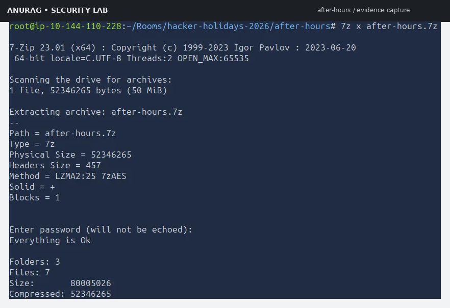
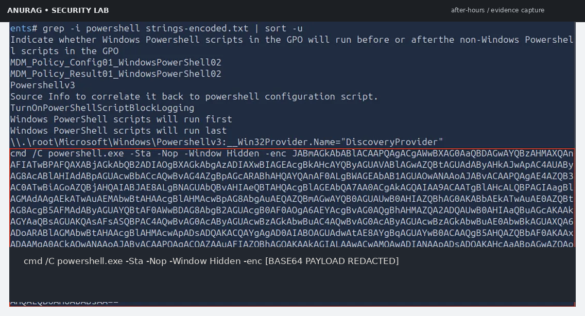
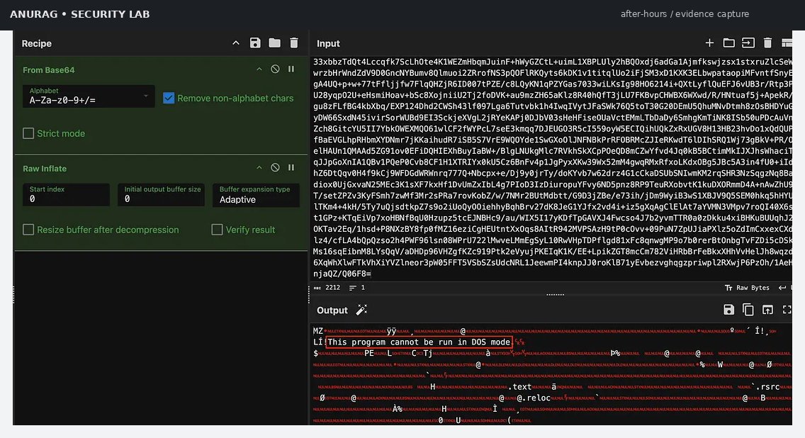
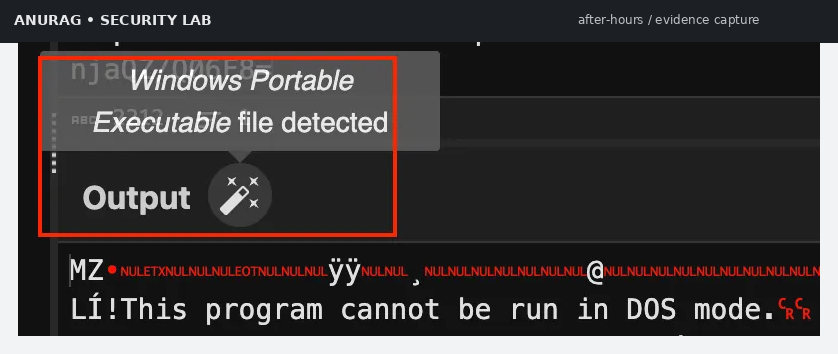
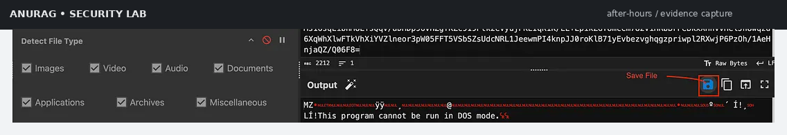
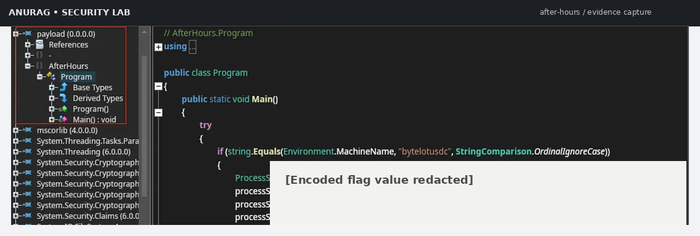
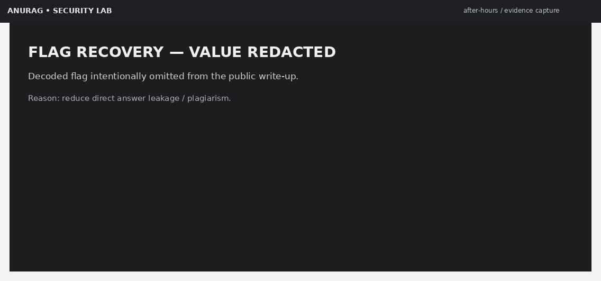

<div align="center">

# 🌙 AFTER HOURS

## Windows Digital Forensics & Malware Analysis Investigation

### TryHackMe • Hacker Holidays 2026 • Day 12


<br>


### 🔍 A Complete DFIR Investigation Into Hidden Windows Persistence

*PowerShell Threat Hunting • WMI Persistence • Base64 & Deflate Analysis • PE Recovery • ILSpy Reverse Engineering*

</div>

---

# 👨‍💻 About This Investigation

> [!NOTE]
> This repository documents a **complete Digital Forensics & Malware Analysis investigation** performed in the **After Hours** TryHackMe room from **Hacker Holidays 2026**.
>
> Rather than exploiting a vulnerable target, this challenge focuses on investigating Windows forensic artifacts, uncovering hidden persistence mechanisms, decoding malicious PowerShell payloads, recovering a concealed .NET executable, and reverse engineering attacker behavior without executing malware.

The investigation follows a realistic **SOC / DFIR analyst workflow**, documenting every phase from evidence acquisition to defensive recommendations.

---

# 🚨 Threat Briefing

<table>
<tr><td width="220"><strong>Scenario</strong></td><td>Suspicious Windows persistence after business hours.</td></tr>
<tr><td><strong>Attack Style</strong></td><td>PowerShell Loader + WMI Configuration Abuse.</td></tr>
<tr><td><strong>Category</strong></td><td>Digital Forensics & Malware Analysis.</td></tr>
<tr><td><strong>Objective</strong></td><td>Recover malicious payload without executing malware.</td></tr>
<tr><td><strong>Analysis Method</strong></td><td>Static Forensics + Reverse Engineering.</td></tr>
<tr><td><strong>Status</strong></td><td>Investigation Completed ✅</td></tr>
</table>

---

# ⚡ Investigation Dashboard

<table>
<tr>
<td align="center" width="33%">

## 🧪 Category

**Windows DFIR**

PowerShell • WMI • Malware Analysis

</td>

<td align="center" width="33%">

## 🎯 Difficulty

**Medium**

Static Investigation

</td>

<td align="center" width="33%">

## 🛡 Focus

**Blue Team**

Incident Response Workflow

</td>
</tr>
</table>

---

## 🧰 Technologies Used

<table>
<tr>
<td align="center">🪟 Windows</td>
<td align="center">💻 PowerShell</td>
<td align="center">📁 WMI</td>
<td align="center">🍳 CyberChef</td>
</tr>

<tr>
<td align="center">🧬 ILSpy</td>
<td align="center">📦 Deflate</td>
<td align="center">🔐 Base64</td>
<td align="center">📄 PE Analysis</td>
</tr>

<tr>
<td align="center">🐧 Linux CLI</td>
<td align="center">🧾 Strings</td>
<td align="center">🔍 Grep</td>
<td align="center">🛡 DFIR</td>
</tr>
</table>

---

# 📚 Skills Demonstrated

<table>
<tr><td width="240"><strong>Windows Forensics</strong></td><td>Evidence collection, artifact parsing, WMI persistence hunting.</td></tr>

<tr><td><strong>PowerShell Analysis</strong></td><td>Encoded command recovery and safe offline decoding.</td></tr>

<tr><td><strong>Malware Analysis</strong></td><td>Payload extraction, PE validation, malware behavior reconstruction.</td></tr>

<tr><td><strong>Reverse Engineering</strong></td><td>Static .NET executable analysis using ILSpy.</td></tr>

<tr><td><strong>Threat Hunting</strong></td><td>IOC extraction, Sigma concepts, Sysmon hunting opportunities.</td></tr>

<tr><td><strong>Incident Documentation</strong></td><td>Professional DFIR report suitable for cybersecurity portfolio.</td></tr>
</table>

---

# 🗺 Navigation

<table>
<tr>
<td align="center" width="33%">

## 📘 Full Report

**Documentation**

`Documentation/Documentation.md`

Complete 6,000-word forensic report.

</td>

<td align="center" width="33%">

## 📝 Analyst Notes

**Quick Notes**

`Resources/notes.md`

Commands, observations, and IOC notebook.

</td>

<td align="center" width="33%">

## 📄 GitHub README

**Repository Overview**

`README.md`

Project landing page.

</td>
</tr>
</table>

---

# 🎯 Investigation Objectives

The investigation was performed with four primary objectives.

<table>
<tr><th width="60">Phase</th><th>Objective</th></tr>

<tr>
<td align="center">1️⃣</td>
<td>Identify hidden Windows persistence artifacts inside supplied forensic evidence.</td>
</tr>

<tr>
<td align="center">2️⃣</td>
<td>Recover and decode malicious PowerShell execution logic safely.</td>
</tr>

<tr>
<td align="center">3️⃣</td>
<td>Extract an embedded executable payload stored inside Windows Management Instrumentation.</td>
</tr>

<tr>
<td align="center">4️⃣</td>
<td>Reverse engineer malware behavior using static analysis techniques.</td>
</tr>

</table>

---

# 🧠 Executive Summary

> [!TIP]
> This room simulates a compromised Windows endpoint where persistence has been deliberately hidden outside common startup locations.

Traditional persistence locations appeared clean:

* Registry Run Keys.
* Startup Folder.
* Scheduled Tasks.
* Services.

Despite that, suspicious activity continued occurring **after business hours**.

The investigation uncovered:

<table>
<tr><td width="260"><strong>Hidden PowerShell Loader</strong></td><td>Encoded PowerShell executed through `cmd.exe`.</td></tr>

<tr><td><strong>WMI Configuration Storage</strong></td><td>Malicious payload hidden inside Windows Management Instrumentation.</td></tr>

<tr><td><strong>Base64 + Deflate Payload</strong></td><td>Compressed executable embedded inside configuration data.</td></tr>

<tr><td><strong>Portable Executable Recovery</strong></td><td>Recovered Windows PE without executing malware.</td></tr>

<tr><td><strong>.NET Reverse Engineering</strong></td><td>ILSpy reconstructed malware execution logic.</td></tr>

<tr><td><strong>Incident Documentation</strong></td><td>Complete IOC and defensive analysis produced.</td></tr>
</table>

---

# 📈 Investigation Timeline

The investigation followed a structured Digital Forensics workflow.

```text
Evidence Acquisition
        │
        ▼
Artifact Enumeration
        │
        ▼
PowerShell Discovery
        │
        ▼
CyberChef Decoding
        │
        ▼
Payload Extraction
        │
        ▼
PE Validation
        │
        ▼
ILSpy Reverse Engineering
        │
        ▼
IOC Documentation
        │
        ▼
Detection Engineering
```

---

# 🕓 Incident Timeline

<table>
<tr><th width="140">Time</th><th>Investigation Activity</th></tr>

<tr>
<td>🟢 T+00</td>
<td>Evidence package extracted inside TryHackMe AttackBox.</td>
</tr>

<tr>
<td>🟢 T+05</td>
<td>Windows forensic artifacts enumerated using Linux utilities.</td>
</tr>

<tr>
<td>🟢 T+10</td>
<td>Suspicious PowerShell execution chain identified.</td>
</tr>

<tr>
<td>🟡 T+20</td>
<td>Encoded Base64 PowerShell payload decoded safely in CyberChef.</td>
</tr>

<tr>
<td>🟡 T+30</td>
<td>Hidden WMI configuration property recovered.</td>
</tr>

<tr>
<td>🟠 T+40</td>
<td>Compressed executable extracted through Raw Inflate.</td>
</tr>

<tr>
<td>🟠 T+50</td>
<td>Portable Executable validated and preserved.</td>
</tr>

<tr>
<td>🔴 T+60</td>
<td>.NET malware statically analyzed using ILSpy.</td>
</tr>

<tr>
<td>🔴 T+70</td>
<td>Indicators of Compromise documented.</td>
</tr>

<tr>
<td>✅ Final</td>
<td>Complete DFIR investigation report published.</td>
</tr>

</table>

---

# 💻 Lab Environment

<table>
<tr><td width="220"><strong>Investigation Platform</strong></td><td>TryHackMe AttackBox</td></tr>

<tr><td><strong>Operating System</strong></td><td>Linux Investigation Environment</td></tr>

<tr><td><strong>Target Platform</strong></td><td>Windows Forensic Artifacts</td></tr>

<tr><td><strong>Malware Type</strong></td><td>.NET Portable Executable</td></tr>

<tr><td><strong>Investigation Style</strong></td><td>Static Malware Analysis</td></tr>

<tr><td><strong>Execution</strong></td><td>None (Offline Analysis)</td></tr>
</table>

---

# 🗂 Investigation Workspace


**Figure 1.** Investigation workspace prepared inside the TryHackMe AttackBox environment.

The workspace contains:

* Challenge archive.
* Forensic artifacts.
* Investigation tools.
* ILSpy binaries.
* Malware sample components.

---

# 📁 Evidence Acquisition

> [!IMPORTANT]
> All investigation work was performed on extracted forensic artifacts while preserving original evidence integrity.

### Evidence Directory

```bash
/root/Rooms/hacker-holidays-2026/after-hours/
```

---

## Initial Evidence Collection

<table>
<tr><th width="220">Artifact</th><th>Description</th></tr>

<tr>
<td><code>mappings</code></td>
<td>Windows configuration mapping artifact.</td>
</tr>

<tr>
<td><code>index</code></td>
<td>Metadata and lookup references.</td>
</tr>

<tr>
<td><code>objects.data</code></td>
<td>Hidden configuration storage containing encoded payload.</td>
</tr>

<tr>
<td><code>tools/</code></td>
<td>Reverse engineering utilities including ILSpy.</td>
</tr>

</table>

---



**Figure 2.** Initial forensic artifact inventory after extracting the evidence package.

---

# 🔬 Investigation Methodology

This investigation follows a realistic Digital Forensics workflow instead of executing malware.

<table>
<tr><th width="180">Phase</th><th>Purpose</th></tr>

<tr>
<td>Evidence Collection</td>
<td>Acquire artifacts safely.</td>
</tr>

<tr>
<td>Artifact Enumeration</td>
<td>Extract printable strings and suspicious references.</td>
</tr>

<tr>
<td>Threat Hunting</td>
<td>Locate encoded PowerShell activity.</td>
</tr>

<tr>
<td>Payload Recovery</td>
<td>Decode embedded executable.</td>
</tr>

<tr>
<td>Reverse Engineering</td>
<td>Understand malware behavior.</td>
</tr>

<tr>
<td>Documentation</td>
<td>Create IOC timeline and defensive recommendations.</td>
</tr>

</table>

---

# 🛡 Why This Investigation Matters

> [!NOTE]
> Modern Windows malware increasingly avoids obvious persistence mechanisms.

Instead it may leverage:

* Windows Management Instrumentation.
* Encoded PowerShell.
* Memory-only payload loading.
* Compressed configuration blobs.
* Managed .NET assemblies.

Understanding these behaviors is an essential skill for:

* SOC Analysts.
* DFIR Analysts.
* Incident Responders.
* Malware Analysts.
* Blue Team Engineers.

---

</div>

---

<div align="center">

# 🔍 Phase 2 — Windows Artifact Investigation

### Threat Hunting • PowerShell Analysis • WMI Persistence Discovery

</div>

> [!IMPORTANT]
> The objective of this phase is to investigate Windows forensic artifacts **without executing malware**, preserving evidence integrity throughout the investigation.

---

# 📁 Evidence Enumeration

The extracted challenge directory contains several Windows artifacts that appear unrelated at first glance. Instead of manually opening each file, the investigation begins by extracting every printable string from every artifact.

This mirrors how analysts rapidly triage unknown forensic evidence during Windows incident response.

---

## Artifact Inventory


**Figure 3.** Initial evidence inventory after extracting the challenge archive.

### Evidence Collected

<table>
<tr><th width="220">Artifact</th><th>Purpose During Investigation</th></tr>

<tr>
<td><code>mappings</code></td>
<td>Contains Windows mapping information used during investigation.</td>
</tr>

<tr>
<td><code>index</code></td>
<td>Metadata describing stored configuration objects.</td>
</tr>

<tr>
<td><code>objects.data</code></td>
<td>Primary forensic artifact containing encoded configuration data.</td>
</tr>

<tr>
<td><code>tools/</code></td>
<td>Contains ILSpy used for .NET reverse engineering.</td>
</tr>

</table>

---

# 🧪 Evidence Triage Methodology

Rather than guessing which artifact is malicious, investigators enumerate every printable string.

### Investigation Command

```bash
strings -a * > strings-encoded.txt
```

### Why This Technique?

The `strings` utility extracts:

* ASCII strings.
* Unicode strings.
* Embedded configuration.
* Executable metadata.
* PowerShell commands.
* Registry references.

This quickly exposes suspicious artifacts hidden inside binary files.

---

## DFIR Analyst Note

> [!TIP]
> `strings` is often the fastest way to discover embedded indicators before opening unknown binaries or memory artifacts.

Common discoveries include:

* URLs.
* Registry keys.
* File paths.
* Encoded commands.
* API names.
* Persistence artifacts.

---

# 🎯 Hunting for PowerShell Activity

PowerShell is one of the most abused Windows administrative technologies.

Threat hunters typically search for PowerShell before investigating binaries.

---

## Hunting Command

```bash
grep -i powershell strings-encoded.txt | sort -u
```

### Investigation Goal

Identify:

* Encoded PowerShell.
* Hidden execution.
* WMI references.
* Base64 payloads.

---

## Screenshot — Suspicious PowerShell Discovery



**Figure 4.** Encoded PowerShell command discovered during artifact hunting.

---

# 🚩 Suspicious Findings

The recovered PowerShell command contains several suspicious execution switches.

### Indicators Observed

<table>
<tr><th width="260">Indicator</th><th>Why It Matters</th></tr>

<tr>
<td><code>-enc</code></td>
<td>PowerShell executed using Base64 encoded command.</td>
</tr>

<tr>
<td><code>-nop</code></td>
<td>Runs without PowerShell profile loading.</td>
</tr>

<tr>
<td><code>-Sta</code></td>
<td>Single-threaded apartment execution.</td>
</tr>

<tr>
<td><code>-Window Hidden</code></td>
<td>Suppresses visible PowerShell window.</td>
</tr>

<tr>
<td><code>cmd.exe /C powershell.exe</code></td>
<td>PowerShell launched indirectly through command processor.</td>
</tr>

</table>

---

## Threat Hunting Observation

> [!WARNING]
> Encoded PowerShell combined with hidden execution is a common indicator of malicious scripting.

Possible attacker motivations include:

* Fileless malware.
* Loader execution.
* Payload staging.
* Persistence.
* Defense evasion.

---

# 🔐 Decoding the PowerShell Loader

Instead of executing the recovered command, investigators decode it offline using **CyberChef**.

This preserves forensic integrity while exposing malware logic.

---

## CyberChef Workflow — Stage 1


**Figure 5.** Decoding the PowerShell loader using CyberChef.

---

## Recipe Used

```text
From Base64
        │
        ▼
Remove Null Bytes
```

### Why Remove Null Bytes?

PowerShell frequently stores commands using **UTF-16** encoding.

Removing null bytes converts unreadable Unicode into readable PowerShell syntax.

---

# 🧠 Decoded Script Analysis

The decoded PowerShell script reveals a staged loader.

### High-Level Execution Logic

```text
Read Configuration
        │
        ▼
Decode Base64
        │
        ▼
Inflate Binary
        │
        ▼
Load Assembly Into Memory
```

---

## Analyst Interpretation

Rather than downloading malware from the internet, the loader retrieves configuration directly from Windows Management Instrumentation.

Advantages include:

* Minimal disk artifacts.
* Offline execution.
* Smaller payload storage.
* Reduced signature detection.

---

# 🪟 Windows Management Instrumentation Investigation

The decoded PowerShell references a suspicious WMI property.

### Investigation Command

```bash
grep -C 3 "Win32_HardwareTelemetry" strings-encoded.txt | sort -u
```

This reveals surrounding encoded configuration data.

---

# Why Investigate WMI?

> [!NOTE]
> WMI is frequently overlooked during basic Windows persistence hunting.

Common persistence locations include:

* Startup Folder.
* Run Registry Keys.
* Scheduled Tasks.
* Services.

The malware instead stores configuration inside **Windows Management Instrumentation**.

---

## WMI Persistence Workflow

```text
Windows WMI Namespace
         │
         ▼
Configuration Property
         │
         ▼
Encoded Base64 Blob
         │
         ▼
PowerShell Loader
```

---

## Analyst Findings

The WMI property contains:

<table>
<tr><th width="240">Finding</th><th>Description</th></tr>

<tr>
<td>Large Encoded Blob</td>
<td>High entropy Base64 content.</td>
</tr>

<tr>
<td>Compressed Configuration</td>
<td>Binary compressed before storage.</td>
</tr>

<tr>
<td>Hidden Payload</td>
<td>Executable stored inside configuration.</td>
</tr>

<tr>
<td>Offline Persistence</td>
<td>No network retrieval required.</td>
</tr>

</table>

---

# 🧬 Why Attackers Abuse WMI

> [!TIP]
> WMI persistence often survives basic startup inspections.

Benefits for attackers include:

* Hidden storage location.
* Administrative legitimacy.
* Difficult manual discovery.
* PowerShell accessibility.
* Native Windows technology.

---

# 📦 Recovering the Embedded Payload

The Base64 blob recovered from WMI still contains compressed binary content.

CyberChef performs a second decoding stage.

---

## CyberChef Workflow — Stage 2


**Figure 6.** Recovering compressed executable payload using Raw Inflate.

---

## Recipe Chain

```text
From Base64
        │
        ▼
Raw Inflate
```

### Investigation Goal

Recover executable bytes stored inside compressed configuration data.

---

# 📈 Payload Recovery Pipeline

```text
Encoded WMI Blob
       │
       ▼
Base64 Decode
       │
       ▼
Compressed Bytes
       │
       ▼
Raw Inflate
       │
       ▼
Windows Executable
```

---

## Analyst Observation

After decompression:

* Binary becomes recognizable.
* DOS executable header appears.
* Windows executable metadata becomes visible.

No malware execution is necessary.

---

# 🪟 Portable Executable Identification

Recovered payload begins with recognizable Windows executable indicators.

---

## Screenshot — PE Detection



**Figure 7.** Windows Portable Executable signature identified.

---

## PE Validation Checklist

<table>
<tr><th width="220">Validation Step</th><th>Result</th></tr>

<tr>
<td>MZ Signature</td>
<td>✅ Present</td>
</tr>

<tr>
<td>DOS Stub</td>
<td>✅ Present</td>
</tr>

<tr>
<td>Windows PE Format</td>
<td>✅ Valid</td>
</tr>

<tr>
<td>.NET Metadata</td>
<td>✅ Managed Assembly</td>
</tr>

<tr>
<td>Ready for Static Analysis</td>
<td>✅ Yes</td>
</tr>

</table>

---

# 🧪 File Type Verification

CyberChef's file detection validates the recovered payload.



**Figure 8.** CyberChef confirming Windows Portable Executable format.

---

## Evidence Validation

<table>
<tr><th width="240">Attribute</th><th>Observation</th></tr>

<tr>
<td>File Type</td>
<td>Windows Portable Executable</td>
</tr>

<tr>
<td>Architecture</td>
<td>.NET Managed Binary</td>
</tr>

<tr>
<td>Analysis Method</td>
<td>Static Only</td>
</tr>

<tr>
<td>Execution Performed</td>
<td>No</td>
</tr>

</table>

---

# 💾 Preserving the Malware Sample

Rather than executing the recovered executable, investigators export it for offline analysis.

### Suggested Filename

```text
payload.exe
```

### Evidence Preservation Principles

* Preserve original bytes.
* Avoid modification.
* Avoid execution.
* Maintain repeatability.

---

# 🔒 Static Analysis Principles

> [!IMPORTANT]
> Malware investigation should begin with **static analysis** whenever possible.

### Static Analysis Benefits

<table>
<tr><th width="220">Benefit</th><th>Description</th></tr>

<tr>
<td>Safe Investigation</td>
<td>No malware execution required.</td>
</tr>

<tr>
<td>Evidence Integrity</td>
<td>Original artifacts remain unchanged.</td>
</tr>

<tr>
<td>Behavior Reconstruction</td>
<td>Execution flow understood from source code.</td>
</tr>

<tr>
<td>IOC Recovery</td>
<td>Extract strings and configuration safely.</td>
</tr>

</table>

---

# 🧭 Investigation Progress Dashboard

<table>
<tr><th width="260">Phase</th><th>Status</th></tr>

<tr><td>Evidence Collection</td><td>✅ Completed</td></tr>

<tr><td>Artifact Enumeration</td><td>✅ Completed</td></tr>

<tr><td>PowerShell Threat Hunting</td><td>✅ Completed</td></tr>

<tr><td>CyberChef Base64 Analysis</td><td>✅ Completed</td></tr>

<tr><td>WMI Persistence Discovery</td><td>✅ Completed</td></tr>

<tr><td>Payload Recovery</td><td>✅ Completed</td></tr>

<tr><td>Portable Executable Validation</td><td>✅ Completed</td></tr>

<tr><td>Reverse Engineering</td><td>➡️ Next Phase</td></tr>

</table>

---

---

<div align="center">

# 🧬 Phase 3 — Reverse Engineering the Malware Payload

### ILSpy • .NET Static Analysis • Malware Behaviour Reconstruction

</div>

> [!IMPORTANT]
> The recovered executable was analyzed **without execution**. All findings below come from **static reverse engineering** using ILSpy inside the TryHackMe AttackBox environment.

---

# 🔎 Reverse Engineering Overview

Once the Windows Portable Executable was recovered, the investigation moved into **static malware analysis**.

Unlike dynamic malware analysis, static analysis allows investigators to understand malware behavior without allowing the payload to execute.

This approach preserves evidence integrity while exposing attacker logic.

---

# 🧪 Why ILSpy?

The recovered payload is a **managed .NET assembly**, making ILSpy an ideal reverse engineering tool.

## ILSpy Capabilities Used

<table>
<tr><th width="260">Feature</th><th>Purpose During Investigation</th></tr>

<tr>
<td>Assembly Explorer</td>
<td>Inspect executable namespaces and classes.</td>
</tr>

<tr>
<td>C# Decompiler</td>
<td>Reconstruct readable source code.</td>
</tr>

<tr>
<td>Entry Point Analysis</td>
<td>Identify malware execution routine.</td>
</tr>

<tr>
<td>String Viewer</td>
<td>Recover embedded configuration values.</td>
</tr>

<tr>
<td>Metadata Inspection</td>
<td>Validate managed assembly information.</td>
</tr>

</table>

---

# 🖥 Opening the Payload in ILSpy



**Figure 9.** Static analysis of the recovered `.NET` executable using ILSpy.

---

## Investigation Workflow

```text id="kb9h44"
Recovered payload.exe
        │
        ▼
ILSpy Assembly Explorer
        │
        ▼
Namespace Discovery
        │
        ▼
Program Class
        │
        ▼
Main() Entry Point
        │
        ▼
Malware Behaviour Reconstruction
```

---

# 🧩 Assembly Structure

The executable contains a small number of managed classes.

### Components Reviewed

<table>
<tr><th width="240">Assembly Component</th><th>Purpose</th></tr>

<tr>
<td>Assembly Metadata</td>
<td>Basic executable information.</td>
</tr>

<tr>
<td>Namespace</td>
<td>Application namespace used by malware.</td>
</tr>

<tr>
<td>Program Class</td>
<td>Main malware logic.</td>
</tr>

<tr>
<td>Main()</td>
<td>Primary execution routine.</td>
</tr>

<tr>
<td>Embedded Strings</td>
<td>Encoded configuration values.</td>
</tr>

</table>

---

# 🎯 Entry Point Investigation

The `Main()` function controls the malware execution flow.

Instead of immediately executing commands, several checks occur first.

## Behaviour Observed

<table>
<tr><th width="240">Stage</th><th>Observation</th></tr>

<tr>
<td>Environment Validation</td>
<td>Checks Windows machine environment.</td>
</tr>

<tr>
<td>Conditional Execution</td>
<td>Executes payload only if conditions match.</td>
</tr>

<tr>
<td>Process Creation</td>
<td>Builds hidden command execution object.</td>
</tr>

<tr>
<td>Encoded Configuration</td>
<td>Uses embedded Base64 value.</td>
</tr>

</table>

---

# 🧠 Environment Validation

Before launching additional commands, the malware validates the current Windows environment.

## Why Attackers Perform Environment Checks

> [!NOTE]
> Malware frequently verifies its execution environment to avoid analysis sandboxes and unintended hosts.

Possible goals include:

* Sandbox detection.
* Target verification.
* Development testing.
* Environment fingerprinting.
* Controlled execution.

---

## Defensive Insight

Environment validation is commonly associated with:

* Commodity malware.
* Red team tooling.
* Targeted loaders.
* Advanced persistence mechanisms.

Security analysts should document these checks during reverse engineering.

---

# ⚙ Hidden Process Execution

ILSpy reveals the malware creates a hidden Windows process.

## Process Characteristics

<table>
<tr><th width="240">Property</th><th>Observation</th></tr>

<tr>
<td>Parent Process</td>
<td>PowerShell loader invokes hidden command.</td>
</tr>

<tr>
<td>Executable</td>
<td>Windows Command Processor.</td>
</tr>

<tr>
<td>Window Visibility</td>
<td>Hidden.</td>
</tr>

<tr>
<td>User Interaction</td>
<td>None.</td>
</tr>

<tr>
<td>Console Window</td>
<td>Suppressed.</td>
</tr>

</table>

---

## Malware Behaviour Flow

```text id="gvkw2j"
PowerShell Loader
        │
        ▼
Validate Machine
        │
        ▼
Create Hidden Process
        │
        ▼
Execute Embedded Logic
```

---

# 🔐 Embedded Configuration Analysis

The executable contains an embedded encoded string.

The repository intentionally **redacts** this value.

## Sanitized Representation

```text id="0g7haq"
VEhNe1JFREFDVEVEX0ZPUl9QT1JURk9MSU99
```

> [!WARNING]
> The actual decoded challenge value is intentionally omitted from this public repository.

---

# 📦 Malware Configuration Storage

<table>
<tr><th width="240">Configuration Item</th><th>Status</th></tr>

<tr>
<td>Embedded Base64 Value</td>
<td>Recovered</td>
</tr>

<tr>
<td>Decoded Challenge Output</td>
<td>Redacted</td>
</tr>

<tr>
<td>Machine Validation Value</td>
<td>Documented</td>
</tr>

<tr>
<td>Execution Logic</td>
<td>Reconstructed</td>
</tr>

</table>

---

# 🔁 Complete Malware Execution Chain

This investigation reconstructed the malware execution chain from forensic artifacts alone.

```text id="xj0oqj"
Windows Artifact
        │
        ▼
Encoded PowerShell
        │
        ▼
WMI Configuration
        │
        ▼
Base64 Blob
        │
        ▼
Raw Inflate
        │
        ▼
Portable Executable
        │
        ▼
ILSpy Decompiled Source
        │
        ▼
Hidden Process Execution
```

---

# 🧬 Malware Behaviour Dashboard

<table>
<tr><th width="260">Capability</th><th>Status</th></tr>

<tr><td>PowerShell Loader</td><td>✅ Observed</td></tr>

<tr><td>Base64 Obfuscation</td><td>✅ Observed</td></tr>

<tr><td>Deflate Compression</td><td>✅ Observed</td></tr>

<tr><td>WMI Configuration Retrieval</td><td>✅ Observed</td></tr>

<tr><td>Memory Assembly Loading</td><td>✅ Observed</td></tr>

<tr><td>Hidden Process Creation</td><td>✅ Observed</td></tr>

<tr><td>Environment Validation</td><td>✅ Observed</td></tr>

<tr><td>Network Download</td><td>❌ Not Required</td></tr>

<tr><td>Registry Persistence</td><td>❌ Not Observed</td></tr>

<tr><td>Scheduled Task Persistence</td><td>❌ Not Observed</td></tr>

</table>

---

<div align="center">

# 🎯 MITRE ATT&CK Mapping

### Tactics and Techniques Observed During Investigation

</div>

---

## ATT&CK Coverage Matrix

<table>
<tr><th width="180">Technique</th><th width="120">ID</th><th>Description</th></tr>

<tr>
<td>PowerShell</td>
<td><strong>T1059.001</strong></td>
<td>Encoded PowerShell used as malware loader.</td>
</tr>

<tr>
<td>WMI</td>
<td><strong>T1047</strong></td>
<td>Windows Management Instrumentation abused for configuration storage.</td>
</tr>

<tr>
<td>Encoded Files</td>
<td><strong>T1027</strong></td>
<td>Base64 obfuscation hides malicious configuration.</td>
</tr>

<tr>
<td>Deobfuscation</td>
<td><strong>T1140</strong></td>
<td>Payload decoded before execution.</td>
</tr>

<tr>
<td>Memory Loading</td>
<td><strong>T1620</strong></td>
<td>.NET assembly loaded directly into memory.</td>
</tr>

<tr>
<td>Process Execution</td>
<td><strong>T1106</strong></td>
<td>Hidden Windows process launched programmatically.</td>
</tr>

<tr>
<td>Defense Evasion</td>
<td><strong>T1562</strong></td>
<td>Hidden execution and encoded commands reduce visibility.</td>
</tr>

</table>

---

# MITRE ATT&CK Kill Chain

```text id="ovp8yl"
Execution
    │
    ▼
PowerShell Loader
    │
    ▼
Persistence
(WMI Configuration)
    │
    ▼
Defense Evasion
(Base64 + Hidden Window)
    │
    ▼
Execution
(Memory Assembly Loading)
```

---

# 🛡 IOC Dashboard

> [!IMPORTANT]
> All Indicators of Compromise shown below are **sanitized** for responsible publication.

---

## PowerShell Indicators

<table>
<tr><th width="260">Indicator</th><th>Description</th></tr>

<tr>
<td>Encoded PowerShell</td>
<td>Base64 encoded command execution.</td>
</tr>

<tr>
<td>Hidden Window</td>
<td>PowerShell launched invisibly.</td>
</tr>

<tr>
<td>No Profile Execution</td>
<td>PowerShell profile disabled.</td>
</tr>

<tr>
<td>Memory Assembly Loading</td>
<td>.NET assembly executed directly from memory.</td>
</tr>

</table>

---

## WMI Indicators

<table>
<tr><th width="260">Indicator</th><th>Description</th></tr>

<tr>
<td>Custom Configuration Property</td>
<td>Encoded payload stored in WMI.</td>
</tr>

<tr>
<td>Large Base64 Blob</td>
<td>High entropy configuration data.</td>
</tr>

<tr>
<td>Encoded Binary Storage</td>
<td>Compressed executable hidden in WMI.</td>
</tr>

</table>

---

## Malware Indicators

<table>
<tr><th width="260">Indicator</th><th>Description</th></tr>

<tr>
<td>MZ Header</td>
<td>Recovered Windows executable.</td>
</tr>

<tr>
<td>.NET Assembly Metadata</td>
<td>Managed executable recovered.</td>
</tr>

<tr>
<td>Hidden Process Creation</td>
<td>Malware executes hidden command processor.</td>
</tr>

<tr>
<td>Embedded Base64 String</td>
<td>Challenge output stored inside executable.</td>
</tr>

</table>

---

# 🚨 Sanitized Threat Indicators

<table>
<tr><th width="220">IOC</th><th>Portfolio Version</th></tr>

<tr>
<td>Recovered Flag</td>
<td><code>THM&#123;REDACTED_FOR_PORTFOLIO&#125;</code></td>
</tr>

<tr>
<td>Base64 Payload</td>
<td><code>BASE64_REDACTED...</code></td>
</tr>

<tr>
<td>Configuration Blob</td>
<td><code>CONFIG_DATA_REDACTED</code></td>
</tr>

<tr>
<td>Embedded Secret</td>
<td><code>REDACTED</code></td>
</tr>

</table>

---

<div align="center">

# 🛡 Detection Engineering

### Sigma Concepts • Sysmon Hunting • Blue Team Visibility

</div>

---

# Sigma Detection Opportunities

> [!TIP]
> These Sigma examples are educational hunting concepts inspired by the investigation.

---

## Sigma Concept — Encoded PowerShell

```yaml id="ijwnyn"
title: Suspicious Encoded PowerShell Execution

logsource:
  product: windows
  category: process_creation

detection:
  selection:
    Image|endswith: '\powershell.exe'
    CommandLine|contains:
      - '-enc'
      - '-EncodedCommand'

condition: selection

level: high
```

---

## Sigma Concept — Hidden PowerShell Window

```yaml id="mr88pb"
title: Hidden PowerShell Window

detection:
  selection:
    CommandLine|contains:
      - '-Window Hidden'
      - '-nop'
      - '-sta'
```

---

## Sigma Concept — WMI Configuration Retrieval

```yaml id="mlnbwh"
title: Suspicious WMI Configuration Access

detection:
  selection:
    Query|contains:
      - 'Win32_'
      - 'ConfigData'
```

---

# Sysmon Hunting Opportunities

<table>
<tr><th width="200">Sysmon Event</th><th>Threat Hunting Opportunity</th></tr>

<tr>
<td>Event ID 1</td>
<td>Encoded PowerShell process creation.</td>
</tr>

<tr>
<td>Event ID 7</td>
<td>Managed .NET assembly loading.</td>
</tr>

<tr>
<td>Event ID 11</td>
<td>Unexpected executable creation.</td>
</tr>

<tr>
<td>Event ID 19–21</td>
<td>WMI filter and consumer activity.</td>
</tr>

</table>

---

# Threat Hunting Checklist

<table>
<tr><th width="260">Hunt For</th><th>Why</th></tr>

<tr>
<td>PowerShell with <code>-EncodedCommand</code></td>
<td>Common loader behavior.</td>
</tr>

<tr>
<td>Hidden PowerShell Windows</td>
<td>Defense evasion.</td>
</tr>

<tr>
<td>cmd.exe spawning PowerShell</td>
<td>Suspicious parent-child relationship.</td>
</tr>

<tr>
<td>Custom WMI Classes</td>
<td>Persistence hunting.</td>
</tr>

<tr>
<td>Large Encoded WMI Properties</td>
<td>Hidden payload storage.</td>
</tr>

</table>

---

---

<div align="center">

# 📸 Investigation Evidence Gallery

### Complete Visual Timeline of the DFIR Investigation

</div>

> [!NOTE]
> Every screenshot included in this repository has been recreated and sanitized for portfolio publication. Challenge flags, secrets, and sensitive values have been intentionally removed.

---

## 🧩 Phase 1 — Investigation Setup

<table>
<tr>
<td width="50%" align="center">

### Room Overview


**Figure 01**

TryHackMe challenge briefing and investigation scenario.

</td>

<td width="50%" align="center">

### AttackBox Workspace


**Figure 02**

Prepared Linux DFIR investigation environment.

</td>
</tr>
</table>

---

## 📂 Phase 2 — Evidence Collection

<table>
<tr>
<td width="50%" align="center">

### Artifact Inventory


**Figure 03**

Windows forensic artifacts extracted from evidence package.

</td>

<td width="50%" align="center">

### PowerShell Threat Hunting


**Figure 04**

Encoded PowerShell loader discovered during artifact hunting.

</td>
</tr>
</table>

---

## 🔐 Phase 3 — Payload Recovery

<table>
<tr>
<td width="50%" align="center">

### Base64 Decoding Workflow


**Figure 05**

CyberChef decoding encoded PowerShell configuration.

</td>

<td width="50%" align="center">

### Raw Deflate Recovery


**Figure 06**

Recovering compressed executable payload.

</td>
</tr>
</table>

---

## 🪟 Phase 4 — Portable Executable Analysis

<table>
<tr>
<td width="50%" align="center">

### PE Header Identification


**Figure 07**

Windows Portable Executable identified from recovered payload.

</td>

<td width="50%" align="center">

### File Type Validation


**Figure 08**

Recovered payload validated as a managed .NET executable.

</td>
</tr>
</table>

---

## 🧬 Phase 5 — Reverse Engineering

<table>
<tr>
<td width="50%" align="center">

### ILSpy Static Analysis


**Figure 09**

Reverse engineering the recovered executable using ILSpy.

</td>

<td width="50%" align="center">

### Embedded Configuration Analysis



**Figure 10**

Investigating embedded Base64 configuration inside the malware.

</td>
</tr>
</table>

---

## 🚩 Phase 6 — Sanitized Investigation Result

<div align="center">



### Figure 11 — Final Investigation Result (Sanitized)

**Challenge flag intentionally redacted for responsible publication.**

</div>

---

<div align="center">

# 🧠 Digital Forensics Skills Demonstrated

</div>

---

## DFIR Competency Dashboard

<table>
<tr>
<td width="33%" align="center">

### 🪟 Windows DFIR

Artifact Parsing

WMI Investigation

Persistence Hunting

</td>

<td width="33%" align="center">

### ⚡ PowerShell Analysis

Encoded Commands

UTF-16 Decoding

Memory Loader Analysis

</td>

<td width="33%" align="center">

### 🧬 Malware Analysis

PE Recovery

Static Analysis

Behavior Reconstruction

</td>
</tr>

<tr>
<td align="center">

### 🔍 Threat Hunting

IOC Discovery

Artifact Enumeration

WMI Hunting

</td>

<td align="center">

### 🛡 Detection Engineering

Sigma Concepts

Sysmon Hunting

Blue Team Visibility

</td>

<td align="center">

### 📑 Incident Response

Timeline Creation

Evidence Documentation

Defensive Reporting

</td>
</tr>
</table>

---

# 📊 Investigation Summary Dashboard

<table>
<tr><th width="260">Investigation Metric</th><th>Result</th></tr>

<tr>
<td>Evidence Artifacts Reviewed</td>
<td>4 Windows forensic artifacts</td>
</tr>

<tr>
<td>Encoded PowerShell Commands Investigated</td>
<td>1 Primary Loader</td>
</tr>

<tr>
<td>WMI Persistence Objects Reviewed</td>
<td>Custom Configuration Property</td>
</tr>

<tr>
<td>Payloads Recovered</td>
<td>1 Windows Portable Executable</td>
</tr>

<tr>
<td>Malware Executed</td>
<td>❌ No (Static Analysis Only)</td>
</tr>

<tr>
<td>Reverse Engineering Tool</td>
<td>ILSpy</td>
</tr>

<tr>
<td>CyberChef Recipes Applied</td>
<td>Base64 + Remove Null Bytes + Raw Inflate</td>
</tr>

<tr>
<td>Indicators Documented</td>
<td>PowerShell, WMI, PE, Process Creation</td>
</tr>

<tr>
<td>Documentation Produced</td>
<td>README, Documentation, Notes, GitHub Pages</td>
</tr>

</table>

---

<div align="center">

# 🛡 Defensive Recommendations

</div>

> [!TIP]
> The techniques observed in this room resemble behaviors commonly monitored by Windows SOC teams and EDR platforms.

---

## Windows Hardening Recommendations

<table>
<tr><th width="260">Recommendation</th><th>Purpose</th></tr>

<tr>
<td>Enable Script Block Logging</td>
<td>Capture decoded PowerShell commands.</td>
</tr>

<tr>
<td>Enable Module Logging</td>
<td>Monitor imported PowerShell modules.</td>
</tr>

<tr>
<td>Enable Transcription Logging</td>
<td>Record PowerShell execution history.</td>
</tr>

<tr>
<td>Audit WMI Event Consumers</td>
<td>Detect persistence through WMI.</td>
</tr>

<tr>
<td>Monitor Hidden PowerShell Windows</td>
<td>Identify suspicious execution.</td>
</tr>

<tr>
<td>Deploy Sysmon</td>
<td>Collect process, WMI, and image load telemetry.</td>
</tr>

</table>

---

## Threat Hunting Checklist

* [x] Inspect PowerShell Operational Logs.
* [x] Hunt for `-EncodedCommand`.
* [x] Investigate hidden PowerShell windows.
* [x] Review custom WMI namespaces.
* [x] Search large Base64 configuration blobs.
* [x] Validate recovered executables before execution.
* [x] Reverse engineer managed assemblies statically.

---

<div align="center">

# 🚨 MITRE ATT&CK Coverage

</div>

<table>
<tr><th width="120">ATT&CK ID</th><th width="220">Technique</th><th>Tactic</th></tr>

<tr>
<td><strong>T1059.001</strong></td>
<td>PowerShell</td>
<td>Execution</td>
</tr>

<tr>
<td><strong>T1027</strong></td>
<td>Obfuscated / Encoded Files</td>
<td>Defense Evasion</td>
</tr>

<tr>
<td><strong>T1140</strong></td>
<td>Decode / Deobfuscate Files</td>
<td>Defense Evasion</td>
</tr>

<tr>
<td><strong>T1047</strong></td>
<td>Windows Management Instrumentation</td>
<td>Execution / Persistence</td>
</tr>

<tr>
<td><strong>T1620</strong></td>
<td>Reflective / Memory Loading</td>
<td>Execution</td>
</tr>

<tr>
<td><strong>T1106</strong></td>
<td>Native API / Process Creation</td>
<td>Execution</td>
</tr>

<tr>
<td><strong>T1562</strong></td>
<td>Defense Evasion</td>
<td>Defense Evasion</td>
</tr>

</table>

---

<div align="center">

# 📚 Repository Documentation

</div>

<table>
<tr>
<td width="33%" align="center">

## 📄 README

Project overview

Badges

Repository structure

Learning objectives

</td>

<td width="33%" align="center">

## 📘 Documentation

Complete forensic report

Malware analysis

IOC tables

Timeline

</td>

<td width="33%" align="center">

## 📝 Notes

Commands

Investigation notebook

CyberChef workflow

Quick IOC reference

</td>
</tr>
</table>

---

<div align="center">

# 🗂 Repository Structure

</div>

```text id="5uhutx"
After-Hours-TryHackMe-Walkthrough/
│
├── README.md
├── SECURITY.md
├── CONTRIBUTING.md
├── LICENSE
│
├── Documentation/
│   ├── Documentation.md
│   └── Documentation.docx
│
├── Resources/
│   └── notes.md
│
├── Screenshots/
│   ├── 01_room-overview.png
│   ├── 02_workspace-access.png
│   ├── 03_artifact-inventory.png
│   ├── 04_powershell-discovery.png
│   ├── 05_base64-decoding.png
│   ├── 06_deflate-payload.png
│   ├── 07_pe-identification.png
│   ├── 08_pe-filetype-confirmed.png
│   ├── 09_ilspy-analysis.png
│   ├── 10_encoded-final-stage.png
│   └── 11_flag-redacted.png
│
└── docs/
    ├── index.md
    └── assets/
        ├── 01_room-overview.png
        ├── ...
        └── custom.scss
```

---

<div align="center">

# 🎓 What I Learned

</div>

<table>
<tr><th width="260">Security Domain</th><th>Practical Experience</th></tr>

<tr>
<td>Windows Forensics</td>
<td>Artifact triage, WMI inspection, persistence hunting.</td>
</tr>

<tr>
<td>PowerShell Security</td>
<td>Encoded command recovery and analysis.</td>
</tr>

<tr>
<td>Malware Analysis</td>
<td>Payload extraction and PE validation.</td>
</tr>

<tr>
<td>Reverse Engineering</td>
<td>.NET assembly inspection using ILSpy.</td>
</tr>

<tr>
<td>Threat Hunting</td>
<td>IOC extraction and detection opportunities.</td>
</tr>

<tr>
<td>Incident Documentation</td>
<td>Professional DFIR reporting workflow.</td>
</tr>

</table>

---

<div align="center">

# 🌐 Related Portfolio Projects

</div>

<table>
<tr><th width="260">Repository</th><th>Focus Area</th></tr>

<tr>
<td>Infinity Pool</td>
<td>Linux Privilege Escalation</td>
</tr>

<tr>
<td>CryptoCabana</td>
<td>Web Application Security</td>
</tr>

<tr>
<td>Do Not Disturb</td>
<td>Linux Enumeration & Privilege Escalation</td>
</tr>

<tr>
<td>SuperSecretTip</td>
<td>Web Exploitation</td>
</tr>

<tr>
<td>Valenfind</td>
<td>Local File Inclusion & Enumeration</td>
</tr>

<tr>
<td>Corp Website</td>
<td>Web Security & Initial Access</td>
</tr>

<tr>
<td>Active Directory Basics</td>
<td>Windows Active Directory Fundamentals</td>
</tr>

</table>

---

<div align="center">

# ⚠ Responsible Disclosure

</div>

> [!WARNING]
> This GitHub repository intentionally omits challenge secrets.

### Redacted From Publication

<table>
<tr><th width="260">Item</th><th>Status</th></tr>

<tr>
<td>TryHackMe Flag</td>
<td>🔒 Redacted</td>
</tr>

<tr>
<td>Decoded Secret Value</td>
<td>🔒 Redacted</td>
</tr>

<tr>
<td>Embedded Challenge Credentials</td>
<td>🔒 Redacted</td>
</tr>

<tr>
<td>Reusable Payload Secrets</td>
<td>🔒 Redacted</td>
</tr>

</table>

The purpose of this repository is to demonstrate:

* Investigation methodology.
* Malware analysis workflow.
* Windows forensic techniques.
* Defensive security knowledge.

---

<div align="center">

# 📖 References & Learning Resources

</div>

<table>
<tr><th width="260">Resource</th><th>Purpose</th></tr>

<tr>
<td>TryHackMe — After Hours</td>
<td>Original training room.</td>
</tr>

<tr>
<td>CyberChef</td>
<td>Offline payload decoding.</td>
</tr>

<tr>
<td>ILSpy</td>
<td>.NET reverse engineering.</td>
</tr>

<tr>
<td>MITRE ATT&CK Framework</td>
<td>Threat behavior mapping.</td>
</tr>

<tr>
<td>Microsoft Sysmon Documentation</td>
<td>Threat hunting telemetry.</td>
</tr>

<tr>
<td>Sigma Rule Specification</td>
<td>Detection engineering concepts.</td>
</tr>

</table>

---

<div align="center">

# 👨‍💻 Author

## Anurag Revankar 

### Cybersecurity • Digital Forensics • Malware Analysis • Threat Hunting

Building practical cybersecurity labs, DFIR investigations, malware analysis reports, and professional CTF documentation through hands-on learning and portfolio-driven projects.

---

**Portfolio Focus Areas**

🛡 Digital Forensics

🔬 Malware Analysis

⚡ Reverse Engineering

🪟 Windows Security

☁ Cloud & Network Security

🎯 Blue Team Operations

📚 TryHackMe Documentation Projects

---

*"Turning hands-on cybersecurity investigations into professional documentation and portfolio-ready case studies."*

</div>

---

<div align="center">

# 🌙 AFTER HOURS — INVESTIGATION COMPLETE


## Windows Digital Forensics • Malware Analysis • Reverse Engineering

**Hacker Holidays 2026 — Day 12**

**Professional GitHub Pages Documentation**

⭐ *Built for cybersecurity recruiters, DFIR portfolios, and malware analysis learning.*

</div>
